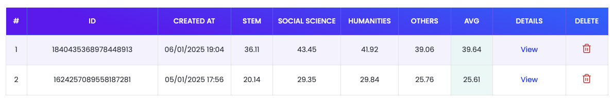
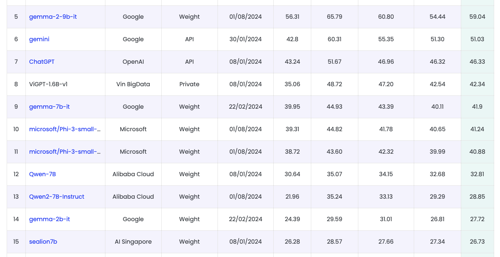

# Benchmark

## Goal

An article typically consists of the following elements: **title**, **description**, **main points**, **categories**, and **tags**.
This fine tuning is designed to address these elements in a single request using a **custom structured format**. Additional objectives include:

1. Enhancing the model's ability to process and respond effectively in the **local language**.
2. Improving the structured output format for better usability.

### Gemma 2B - Evaluation Results

The performance of the **Gemma 2B model** was assessed using **ROUGE** and **Google BLEU** metrics.

| Rouge1 | Rouge2 | RougeL | RougeLSum | Google BLEU |
|--------|:------:|:------:|:---------:|:-----------:|
| 0.722  | 0.524  | 0.456  |   0.703   |    0.345    |

**Key Observations**:

* The model shows significant improvements in:
    * Handling user language responses.
    * Structured content generation.

* **Challenges**:
    * Incomplete feedback for certain articles.
    * Occasional duplication of keywords in responses.

For more details, you can read version 1 of this Notebook: ([**Version 1**](https://www.kaggle.com/code/bigfishdev/gemma-2b-it-fine-tuning-with-gemma-template?scriptVersionId=216121364)). Also, you can download the file `gemma-benchmark/gemma_2b_eval_benchmark.json` which I have attached on this notebook.

Due to Kaggle limitations, I am currently unable to implement **ROUGE** and **Google BLEU** eval evaluations on the **Gemma 2B IT** ([**Version 2**](https://www.kaggle.com/code/bigfishdev/gemma-2b-it-fine-tuning-with-gemma-template?scriptVersionId=216252050)) model that I have refined.
I will show a demo how I eval the dataset and the source code at the end of this notebook.

* **Kaggle Gemma 2B Model:**
    * Model: [https://www.kaggle.com/models/bigfishdev/gemma-template-gemma-2b](https://www.kaggle.com/models/bigfishdev/gemma-template-gemma-2b)
    * Notebook Version 1: [https://www.kaggle.com/code/bigfishdev/gemma-2b-it-fine-tuning-with-gemma-template?scriptVersionId=216121364](https://www.kaggle.com/code/bigfishdev/gemma-2b-it-fine-tuning-with-gemma-template?scriptVersionId=216121364)
* **Kaggle Gemma 2B IT Model:**
    * Model: [https://www.kaggle.com/models/bigfishdev/gemma-template-gemma-2b-it](https://www.kaggle.com/models/bigfishdev/gemma-template-gemma-2b-it)
    * Notebook Version 2: [https://www.kaggle.com/code/bigfishdev/gemma-2b-it-fine-tuning-with-gemma-template?scriptVersionId=216252050](https://www.kaggle.com/code/bigfishdev/gemma-2b-it-fine-tuning-with-gemma-template?scriptVersionId=216252050)
* **Dataset:** [https://www.kaggle.com/datasets/bigfishdev/gemma-template](https://www.kaggle.com/datasets/bigfishdev/gemma-template)
* **Benchmark:** All benchmarks will be updated at my Github repo: [https://github.com/thewebscraping/gemma-template/blob/main/docs/benchmark.md](https://github.com/thewebscraping/gemma-template/blob/main/docs/benchmark.md)

### Gemma 2B - Vietnamese VMLU Evaluation Results
VMLU is a benchmark suite designed to evaluate foundational models with a focus on the **Vietnamese language**.

| ID                  |    Created At    | Stem  | Social Science | Humanities | Others |  AVG  | Unanswered |
|---------------------|:----------------:|:-----:|:--------------:|:----------:|:------:|:-----:|:----------:|
| 1624257089558187281 | 05/01/2025 17:56 | 20.14 |     29.35      |   29.84    | 25.76  | 25.61 |    1497    |

#### Results
* Out of 9,834 attempts, 1,497 responses were unanswered.
* The dataset and evaluation results can be downloaded from the file: `gemma-benchmark/gemma_2b_vmlu_answers.csv`. Although it is not within the scope of this fine tuning.

### Gemma 2B IT - Vietnamese VMLU Evaluation Results

| ID                  |    Created At    | Stem  | Social Science | Humanities | Others |  AVG  | Unanswered |
|---------------------|:----------------:|:-----:|:--------------:|:----------:|:------:|:-----:|:----------:|
| 1840435368978448913 | 06/01/2025 19:04 | 36.11 |     43.45      |   41.92    | 39.06  | 39.64 |     82     |

#### Results
* Out of 9,834 attempts, 82 responses were unanswered.
* The dataset and evaluation results can be downloaded from the file: `gemma-benchmark/gemma_2b_it_vmlu_benchmark.csv`. Although it is not within the scope of this fine tuning.

#### My Gemma Fine Tuning VMLU Score

#### VMLU Leaderboard
There is a clear difference between the VMLU rankings in the Gemma 2B IT fine tuning, the score is close to the score of the **Gemma 7B IT** model. Here is a screenshot of the **VMLU Leaderboard** rankings:

#### Additional Resources
* VMLU Website: [https://vmlu.ai/](https://vmlu.ai/)
* VMLU Leaderboard: [https://vmlu.ai/leaderboard](https://vmlu.ai/leaderboard)
* VMLU Github Repository: [https://github.com/ZaloAI-Jaist/VMLU/](https://github.com/ZaloAI-Jaist/VMLU/)
